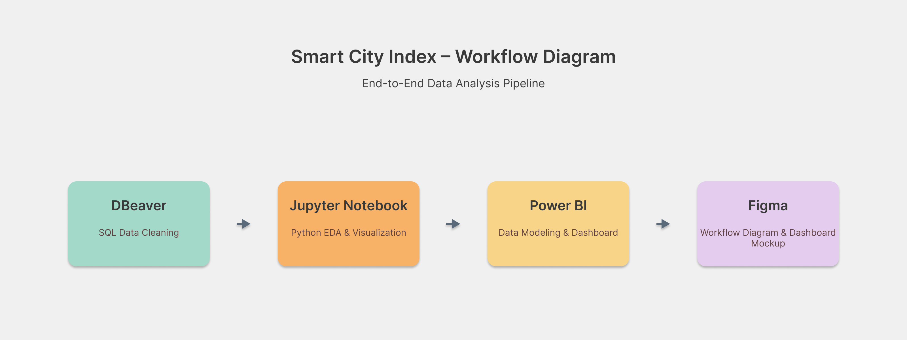
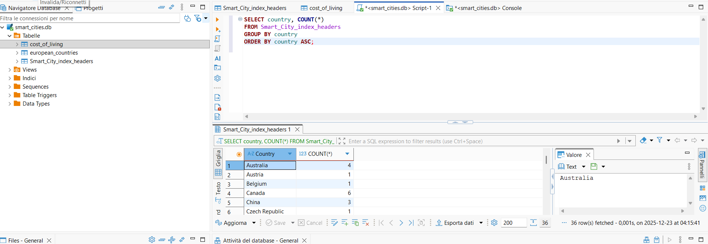
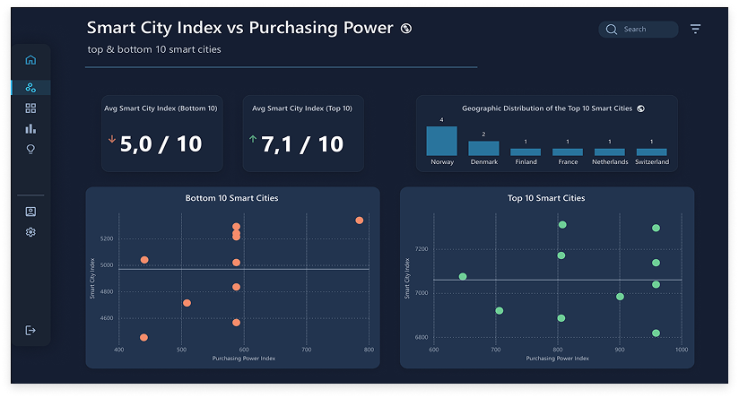
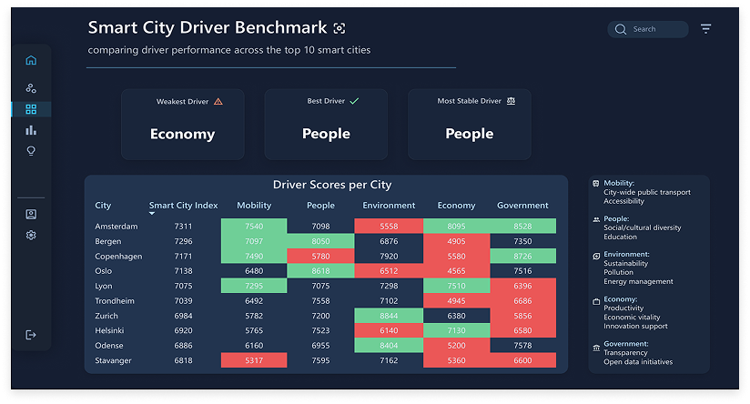
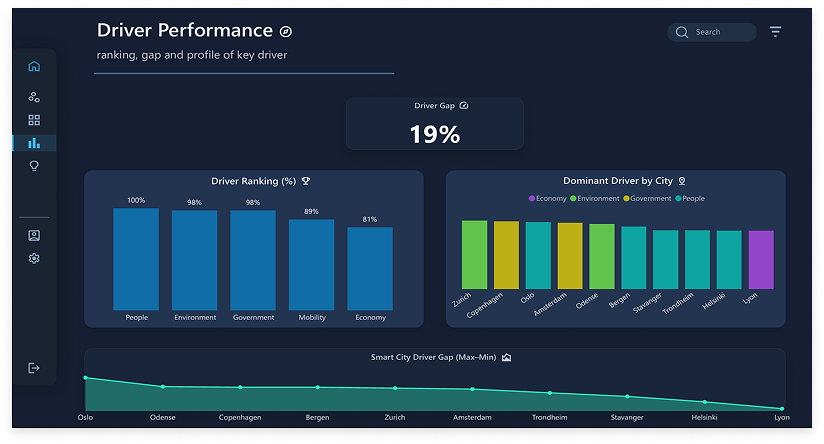
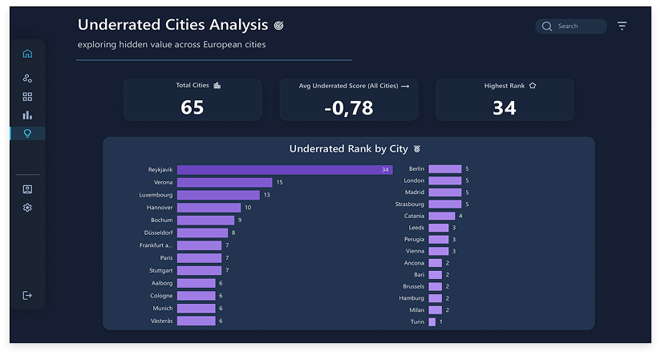
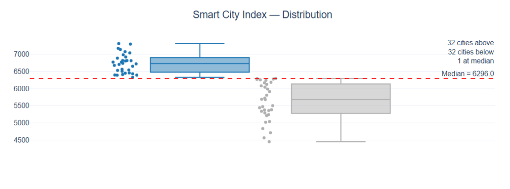

# 🏙️ European Smart City Performance
Benchmarking, drivers and hidden value across 65 cities

  

## 📊 Overview
This project analyzes the performance of 65 European smart cities through a combined macro and micro perspective.  
The main objective is to identify where cities can improve by examining the gaps between performance drivers and understanding what top‑ranked cities do differently.

At the macro level, the analysis highlights which cities lead the Smart City Index and which ones lag behind.  
At the micro level, it evaluates whether strong results are driven by economic wealth or by other structural and qualitative factors, and identifies the weakest drivers that represent the most strategic areas for improvement.

## 🎯 Objectives
- Understand what differentiates leading and lagging European smart cities in the Smart City Index.  
- Compare performance across key drivers such as People, Government, Environment, Mobility and Economy.  
- Explore the relationship between Purchasing Power and smart‑city performance.  
- Provide a clear, visual benchmark to support data‑driven discussions on urban development.

## 📂 Data Source
The original dataset includes a global collection of smart‑city indicators.  
For this project, only the European cities contained in the dataset were selected, resulting in a final sample of 65 cities.

## 🧱 Driver Definitions
To better interpret the dashboards, the Smart City Index drivers are defined as follows:

- **People:** education, cultural diversity and social inclusion.  
- **Environment:** environmental sustainability, pollution monitoring and energy‑management initiatives.  
- **Government:** transparency, digital public services and effectiveness of local administration.  
- **Mobility:** transport efficiency, infrastructure, accessibility and ICT integration.  
- **Economy:** productivity, economic vitality and support for entrepreneurship and innovation.  
- **Smart City Index:** aggregate score combining all drivers into a unified performance metric.

## 🧭 Methodology
Only city‑level indicators were included to ensure consistent comparison across all selected cities.

The Living driver was excluded after verifying that its values were identical for cities within the same country, indicating that it was reported at national rather than city level.

The Purchasing Power variable was extracted from the World Economic Data dataset.  
Although the two datasets refer to slightly different years, the gap is minimal and the variable was used only for an exploratory scatter plot, not for driver comparison.

## 🔑 Key Insights
The dashboards reveal a coherent set of patterns explaining why some European cities lead the Smart City Index while others lag behind.

### 1) Smart City Index vs Purchasing Power (Top 10 vs Bottom 10)
Purchasing Power influences performance, but only to a limited extent.  
Top‑ranked cities generally score above average economically, yet the #1 city has a lower Purchasing Power than the #2.  
This suggests that economic strength supports—but does not determine—smart‑city leadership.

### 2) Benchmark of Drivers (Top 10)
Among the top cities, People is the strongest driver, while Economy is the weakest.  
Combined with the previous insight, this indicates that high performance is driven more by social, governance and mobility factors than by pure economic wealth.  
Notably, Mobility appears above average in 4 of the top 5 cities, highlighting it as a critical enabler that may indirectly strengthen other non‑economic drivers.

### 3) Driver Performance (Top 10)
Performance gaps are balanced across drivers, but the most frequent top driver is People (5 out of 10 cities), followed by Environment and Governance (2 each).  
Economy is the top driver in only one city.  
This reinforces the idea that **structural quality and citizen‑centric policies matter more than national wealth**.

### 4) Underrated Cities
The Smart City Index generally aligns with city performance, with an average deviation of –0.78 among underrated cities.  
However, one city stands out as significantly undervalued, suggesting that its strengths are not fully captured by the index and may represent hidden potential.

### 📝 Summary
Across all dashboards, a consistent pattern emerges: economic wealth matters, but it is not the main engine of smart‑city performance.  
Purchasing Power proves more informative than the Economy driver, suggesting that what truly counts is the balance between income levels and cost of living rather than raw economic strength.

Cities that lead the index combine this economic equilibrium with strong qualitative drivers especially People, Environment and Mobility which reinforce each other and sustain long‑term performance.  
Underperforming cities can improve by focusing on these structural drivers, even without major economic expansion.

## 🧭 Workflow
The project follows an end‑to‑end analytical pipeline integrating data cleaning, validation, dashboard development and visual design.

### 🔄 Workflow Diagram

### 1) Data Access & Cleaning (DBeaver)
Two separate datasets were explored and cleaned in DBeaver:  
- the Smart Cities Index dataset 
- the World Economic Data database (containing the Purchasing Power indicator)

The two sources were merged to align city‑level information, but only the Purchasing Power variable was retained from the World Economic Data dataset.  
After the merge, the dataset was filtered to include only European cities, ensuring consistency and comparability across indicators.

### 2) Exploratory Analysis & Validation (Python – Jupyter Notebook)
Python was used to perform a structured validation of the merged dataset, including:  
- structural checks  
- consistency verification across drivers  
- exploratory analysis to confirm data quality  

Several exploratory charts were produced, but only the distribution plot was included in the final report to maintain clarity and avoid redundancy.

### 3) Data Modeling & Dashboard Development (Power BI)
Cleaned and validated data was imported into Power BI to build four dashboards, each focusing on a different analytical perspective:

- Smart City Index vs Purchasing Power (Top 10 vs Bottom 10)  
- Benchmark of Drivers (Top 10)  
- Driver Performance (Top 10)  
- Underrated Cities Analysis  

These dashboards were designed to highlight structural differences between leading and lagging European cities.

### 4) Visual Design & Layout Refinement (Figma)
Figma was used to refine the visual presentation of the project, including:  
- the workflow diagram  
- the dashboard mockup  
- spacing, alignment and visual hierarchy  
- the project cover for GitHub  

This ensured a consistent, modern and premium aesthetic across all project assets.

## 📸 Dashboard Gallery  
A curated selection of visual outputs developed for the project, including four Power BI dashboards and one Plotly exploratory chart.

### 1) Smart City Index vs Purchasing Power  
Comparison between the highest‑ and lowest‑ranked cities, showing how Purchasing Power aligns with Smart City Index scores. (Power BI)  

### 2) Smart City Driver Benchmark (Top 10)  
Cross‑driver comparison for the top 10 cities, highlighting differences in structural performance across People, Environment, Government, Mobility and Economy. (Power BI)  

### 3) Smart City Driver Performance (Top 10)  
Overview of dominant drivers, driver gaps and performance balance across the top‑ranked cities. (Power BI)  

### 4) Smart City Underrated Cities  
Identification of cities whose Smart City Index score underestimates their actual driver performance. (Power BI)  

### 5) Smart City Distribution 
Exploratory distribution of Smart City Index scores to highlight variability across European cities. (Plotly)

## 🚀 Next Steps  
If additional data becomes available, the analysis could be extended by:

- **Time‑series analysis** — Exploring how Smart City Index scores evolve over multiple years.  
- **Additional indicators** — Integrating new drivers or complementary socio‑economic variables to enrich the analytical depth.

These enhancements would provide a broader perspective while keeping the current analytical framework intact.

## 📜 License & Attribution  
The datasets used in this project are sourced from Kaggle and released under the **CC0 – Public Domain** license by their respective authors.

- **World Economic Data** — Contains national‑level Purchasing Power indicators.  
  Source: Kaggle  
  License: CC0 – Public Domain  
  Reference year: ~4 years ago  

- **Smart Cities Index Dataset** — Includes city‑level smart‑city performance indicators across five drivers.  
  Source: Kaggle  
  License: CC0 – Public Domain  
  Reference year: ~5 years ago  
